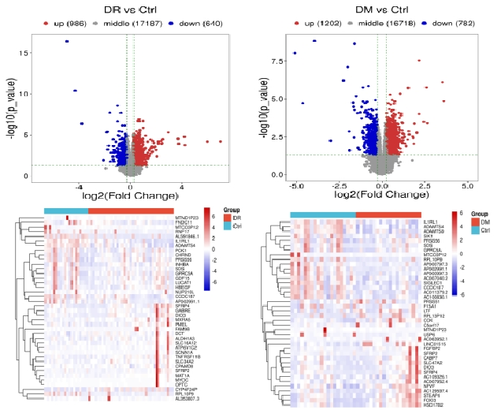
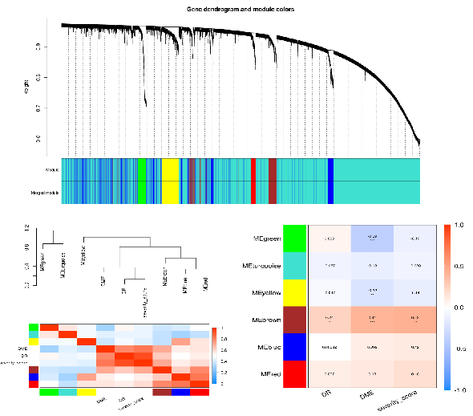
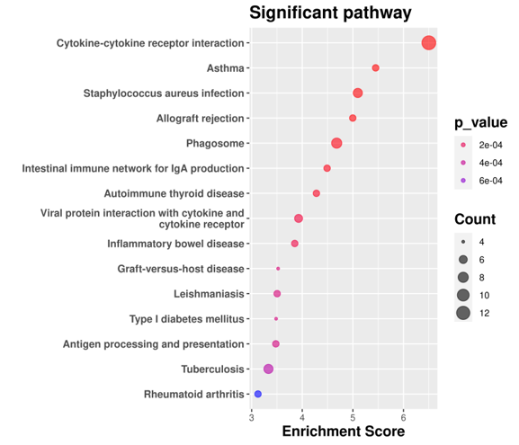
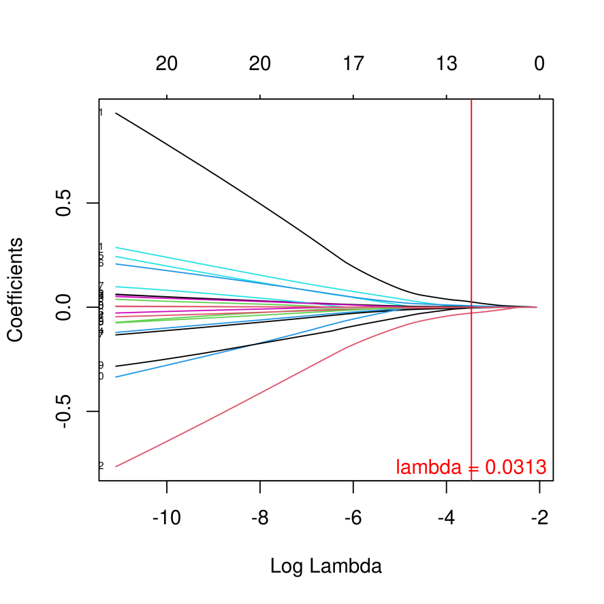
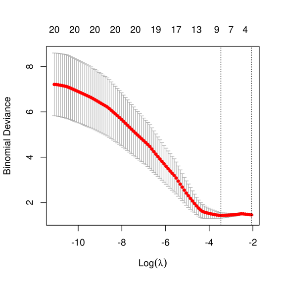
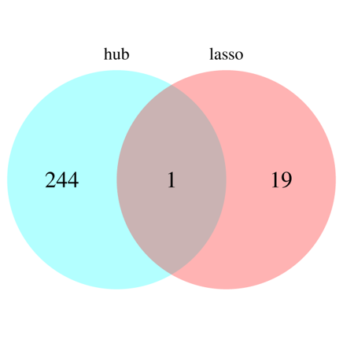
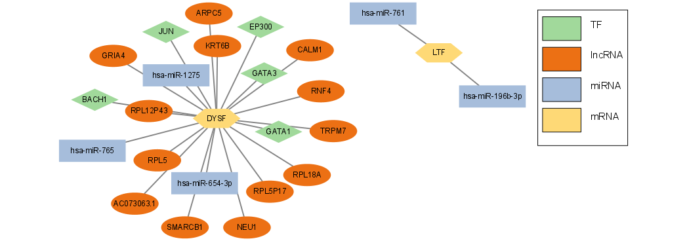

# Exploring-diagnostic-markers-and-transcriptional-regulation-mechanism-of-diabetes-retinopathy

# 1.Explore genes and related functions specifically expressed in disease groups

# 2. Exploring disease diagnostic biomarkers

# 3.Exploring regulatory mechanism of target genes and their performance as diagnostic markers

